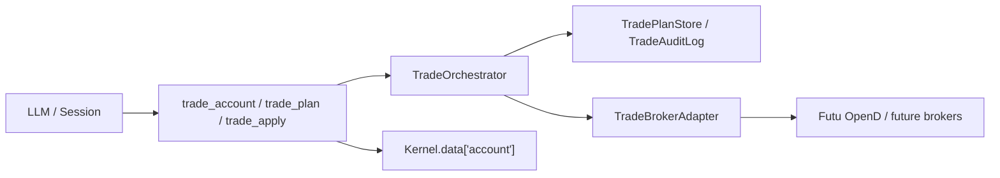

# Trading — 交易边界层设计规格

## 1. 目标

交易 V1 的目标不是接完某家券商的全部能力，而是在 AthenaClaw 中建立一套稳定、可扩展、可审计的交易骨架。

V1 只覆盖最小人工下单闭环：

- 列远端 broker 可用账户
- 读取当前持仓
- 读取未完成订单
- 提交股票/ETF 限价单
- 查询订单当前状态
- 撤销未完成订单
- 成交后刷新当前活动账户快照，供 `compute` 使用

非目标：

- 不做自动交易
- 不做独立交易服务进程
- 不自动把远端 broker 状态写回 `portfolio.json`
- 不做 `MARKET`、止损单、条件单、TWAP/VWAP、期权/期货/融资融券

## 2. 分层架构

三层职责：

- `tool` 层：LLM 接口、参数 schema、确认交互、结果格式化、`Kernel.data` 注入
- `TradeOrchestrator`：交易域规则、plan 生命周期、canonical 状态/错误、apply 后回读
- `TradeBrokerAdapter`：broker SDK/API 接入和字段翻译

这里的“交易边界层”是一个**进程内模块**，不是独立微服务。代码主对象统一叫 `TradeOrchestrator`。

## 3. `TradeOrchestrator` 的定位

它的唯一职责是：把 Agent 产生的交易意图，转成**确定性、可确认、可执行、可回读**的 canonical 流程。

属于它的职责：

- 校验 V1 公共约束：股票/ETF、`LIMIT`、`BUY/SELL/CANCEL`
- 统一 canonical 输入输出
- 生成 `TradePlan`
- 生成 `plan_summary` 与 `confirm_text`
- 管理 `plan_id`、TTL、单次消费、重复 apply 幂等
- 统一 canonical 订单状态与错误码
- apply 后补查订单状态，必要时补查持仓
- 生成标准化账户快照，交给 tool 层写入 `Kernel.data["account"]`

不属于它的职责：

- 自然语言理解
- prompt 拼装
- CLI/TUI/IM 确认 UI
- OpenD 连接、SDK session、provider 原始枚举
- `portfolio.json` / `watchlist.json` 维护
- 自动交易、策略执行、回调 worker
- 行情拉取

边界判定原则：

- 随交互入口变化的是 tool/UI 层
- 随 broker 变化的是 adapter 层
- “无论哪个入口、哪个 broker 都必须成立”的交易规则，才进入 `TradeOrchestrator`

## 4. Canonical 接口

公共能力只要求 broker adapter 实现：

- `list_accounts()`
- `get_positions(account_ref)`
- `get_open_orders(account_ref)`
- `get_order_status(order_ref)`
- `submit_limit_order(intent)`
- `cancel_order(order_ref)`

可选增强：

- `get_account_summary(account_ref)`
- `preview_limit_order(intent)`

### 账户发现

`list_accounts()` 返回的每个账户描述，除了基础标识外，还应包含一组稳定的账户能力字段：

- `supported_markets`
- `account_status`
- `account_kind`
- `is_simulated`
- `extra`

这些字段的分工如下：

- 公共字段负责跨 broker 的基础选户语义，例如“这个账户是否 active”“是否支持 US 市场”“是否更像股票户还是期权户”
- `extra` 负责承载 provider 专有信息；V1 只在账户发现落地，不默认扩散到 orders/positions/plan/receipt

Futu 账户发现至少要把这些专有信息放进 `extra`：

- `security_firm`
- `acc_type`
- `sim_acc_type`
- `acc_role`
- `trdmarket_auth`
- `jp_acc_type`
- `uni_card_num`
- `card_num`

canonical 标识：

- `account_ref`
- `order_ref`
- `plan_id`

这三类引用都是系统生成的 opaque string。LLM 只能传递，不能猜测、拼接或修改。

显式参数原则：

- 不做自动承接最近账户
- 不做自动承接最近订单
- 不做 `suggested_account_ref` / `suggested_order_ref`
- 查询具体账户或订单时，必须显式携带对应 ref

canonical 状态只保留：

- `submitted`
- `queued`
- `partially_filled`
- `filled`
- `cancelled`
- `rejected`
- `expired`
- `unknown`

补充结果语义：

- `TradePreview` 可以返回 `normalized_limit_price` 与 `normalization_reason`
- `TradePlan` 可以返回 `normalized_intent`
- `TradeApplyResult` 返回 `finalized` 与 `warnings`
- `status=ok` 只表示工具执行成功；业务上是否已进入终态，要看 `finalized + order_status`

## 5. 工具协议

对外只保留 3 个工具：

- `trade_account`
  - `list_accounts`
  - `get_positions`
  - `get_open_orders`
  - `get_order_status`
  - `get_summary`
- `trade_plan`
  - `submit_limit`
  - `cancel`
- `trade_apply`
  - 只接 `plan_id`

关键约束：

- 所有执行动作必须先 `trade_plan`，后 `trade_apply`
- `trade_apply` 永远只消费 `plan_id`
- tool 不得直连 adapter 的 mutating 方法
- `Kernel.data["account"]` 在 V1 里只表示“当前活动账户快照”
- `trade_account.list_accounts` 必须返回足够的账户能力信息，让用户和 Agent 在不打开券商客户端的前提下也能判断哪个账户支持目标市场
- 缺少 `account_ref` / `order_ref` 时返回 `missing_*` 错误，不做隐式补参

## 6. Prompt 与安全

系统会在交易工具注册时条件注入 `TRADE_GUIDE`。其规则是：

- 先 `trade_plan`，后 `trade_apply`
- 不得伪造 `account_ref/order_ref/plan_id`
- V1 只支持限价单
- `portfolio` 不是远端 broker 账户
- 下单前先看 `trade_account.list_accounts` 里的 `supported_markets`、`account_status`、`account_kind`；`extra` 可用于解释 provider 特有限制
- 查询具体账户或订单时必须显式携带 `account_ref` / `order_ref`
- 在 `trade_apply` 成功前，不能宣称“已提交/已成交”
- 没有同 broker 的新鲜行情或明确 market-state 证据时，不得推断“更容易成交”“当前处于常规交易时段”
- broker 交易不会自动改写 `portfolio.json`

这些规则在 prompt 中做引导，但最终安全边界在代码里执行，不依赖 LLM 自觉遵守。

确认交互统一改成 message-based confirm。  
文件系统工具继续传路径消息；交易工具传动作消息，例如：

- `确认提交 BUY 100 AAPL 限价 180.00 吗？`

## 7. Futu 适配规则

Futu 作为首个 provider，只接证券账户交易。

映射关系：

- `get_acc_list` -> `list_accounts`
- `position_list_query` -> `get_positions`
- `order_list_query` -> `get_open_orders`
- `order_list_query` + `history_order_list_query` -> `get_order_status`
- `place_order(order_type=OrderType.NORMAL)` -> `submit_limit_order`
- `modify_order(ModifyOrderOp.CANCEL)` -> `cancel_order`
- `accinfo_query` -> `get_account_summary`
- `acctradinginfo_query` -> `preview_limit_order`
- `get_market_snapshot(price_spread)` -> provider 内部价格合法化辅助，不暴露为公共工具

Futu 账户发现不做 provider 侧隐式过滤；仍返回全部账户。选户正确性由两层保障：

- `list_accounts` 直接暴露账户能力与 `extra`
- `trade_plan.submit_limit` 在 plan 阶段先做价格规范化，再通过 `preview_limit_order` 前置拦截“不支持该市场/账户已失效/账户类型不适合/最大可买卖不足”等硬失败
- `trade_apply(cancel)` 会在内部做短时、有界的状态确认；若短时内未进入终态，返回 `finalized=false`，而不是假装已经撤单成功

V1 不做：

- `unlock_trade`
- `market order`
- `history deals`
- `fees`
- callback worker

真实账户解锁仍由用户在 OpenD 侧手工完成。

## 8. 扩展原则

新增 broker：

- 只新增 adapter、mapping、配置
- 不改 tool schema
- 不改 canonical 状态与错误码
- 除非该能力已经成为“公共能力”

新增订单类型：

- 先加 capability
- 再加 canonical intent
- 再改 `TradeOrchestrator`
- 最后才改 tool schema 和 `TRADE_GUIDE`

新增 provider 专有能力：

- 默认不进公共交易内核
- 要么作为 adapter 内部增强
- 要么独立为 provider-specific tool

## 9. 测试与验收

单测：

- `TradeOrchestrator` 的 plan/apply/TTL/幂等/状态刷新
- canonical 错误码和状态映射
- 当前活动账户快照语义

合约测试：

- 所有 broker 共用一组 `TradeBrokerAdapter` 行为测试

工具测试：

- `trade_plan -> trade_apply -> get_order_status`
- confirm 拒绝后不执行

验收标准：

- 模拟账户可完成限价单下单、查状态、撤单
- 成交后 `compute` 能读取最新 `account`
- 自动化任务不能执行 `trade_plan` / `trade_apply`
- 缺少 ref 时返回 `missing_*`，而不是 `invalid_*`
- 不在陈旧行情或弱提示上推断成交概率或当前市场状态
