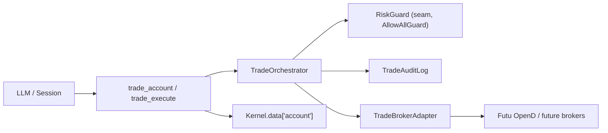

# Trading — 交易边界层设计规格

## 1. 目标

交易系统的目标不是接完某家券商的全部能力，而是在 AthenaClaw 中建立一套稳定、可扩展、可审计的交易骨架。**自主交易是核心目标**：Agent 就是要替代人类完成完全自主的下单/撤单决策与执行，中间不经过人工确认。

V1 覆盖的执行闭环：

- 列远端 broker 可用账户
- 读取当前持仓
- 读取未完成订单
- 提交股票/ETF 限价单
- 查询订单当前状态
- 撤销未完成订单
- 读取同 broker 的实时快照（`market_snapshot`），供下单前判断盘口
- 成交后刷新当前活动账户快照，供 `compute` 使用

非目标：

- 不做独立交易服务进程
- 不自动把远端 broker 状态写回 `portfolio.json`
- 不做 `MARKET`、止损单、条件单、TWAP/VWAP、期权/期货/融资融券
- 不在代码里持有交易密码、不调用 `unlock_trade`（见 §7）
- 这期不做真实风控拦截（见 §6）

## 2. 分层架构

```mermaid
flowchart LR
  LLM["LLM / Session"] --> Tools["trade_account / trade_execute"]
  Tools --> Orch["TradeOrchestrator"]
  Orch --> Guard["RiskGuard (seam, AllowAllGuard)"]
  Orch --> Audit["TradeAuditLog"]
  Orch --> Adapter["TradeBrokerAdapter"]
  Adapter --> Broker["Futu OpenD / future brokers"]
  Tools --> Kernel["Kernel.data['account']"]
```

三层职责：

- `tool` 层：LLM 接口、参数 schema、结果格式化、`Kernel.data` 注入
- `TradeOrchestrator`：交易域规则、canonical 状态/错误、风控裁决入口、执行后回读
- `TradeBrokerAdapter`：broker SDK/API 接入和字段翻译

这里的“交易边界层”是一个**进程内模块**，不是独立微服务。代码主对象统一叫 `TradeOrchestrator`。

## 3. `TradeOrchestrator` 的定位

它的唯一职责是：把 Agent 产生的交易意图，转成**确定性、经风控裁决、可执行、可回读**的 canonical 流程。

属于它的职责：

- 校验 V1 公共约束：股票/ETF、`LIMIT`、`BUY/SELL/CANCEL`
- 统一 canonical 输入输出
- 价格规范化 + preview 前置拦截
- 单次调用内完成：校验 → preview → `RiskGuard.evaluate` → 下单/撤单 → 状态回读
- 统一 canonical 订单状态与错误码
- 执行后补查订单状态，必要时补查持仓
- 生成标准化账户快照，交给 tool 层写入 `Kernel.data["account"]`
- 把每次风控裁决与执行结果写入 `TradeAuditLog`

不属于它的职责：

- 自然语言理解
- prompt 拼装
- 人工确认 UI（交易链路已彻底不需要）
- OpenD 连接、SDK session、provider 原始枚举
- `portfolio.json` / `watchlist.json` 维护
- 真实风控规则本身（见 §6，这期只留 seam）
- 行情拉取（`market_snapshot` 走独立的 `SnapshotAdapter`，不经过 `TradeOrchestrator`）

边界判定原则：

- 随交互入口变化的是 tool/UI 层
- 随 broker 变化的是 adapter 层
- “无论哪个入口、哪个 broker 都必须成立”的交易规则，才进入 `TradeOrchestrator`

## 4. Canonical 接口

公共能力只要求 broker adapter 实现：

- `list_accounts()`
- `get_positions(account_ref)`
- `get_open_orders(account_ref)`
- `get_order_status(order_ref)`
- `submit_limit_order(intent)`
- `cancel_order(order_ref)`

可选增强：

- `get_account_summary(account_ref)`
- `preview_limit_order(intent)`

### 账户发现

`list_accounts()` 返回的每个账户描述，除了基础标识外，还应包含一组稳定的账户能力字段：

- `supported_markets`
- `account_status`
- `account_kind`
- `is_simulated`
- `extra`

这些字段的分工如下：

- 公共字段负责跨 broker 的基础选户语义，例如“这个账户是否 active”“是否支持 US 市场”“是否更像股票户还是期权户”
- `extra` 负责承载 provider 专有信息；V1 只在账户发现落地，不默认扩散到 orders/positions/receipt

Futu 账户发现至少要把这些专有信息放进 `extra`：

- `security_firm`
- `acc_type`
- `sim_acc_type`
- `acc_role`
- `trdmarket_auth`
- `jp_acc_type`
- `uni_card_num`
- `card_num`

canonical 标识：

- `account_ref`
- `order_ref`

这两类引用都是系统生成的 opaque string。LLM 只能传递，不能猜测、拼接或修改。`TradeApplyResult.plan_id` 字段依旧存在，但语义已从“待确认的计划 id”改为“这次一次性执行的 id”，纯粹用于审计追踪，不再有生命周期或消费语义。

显式参数原则：

- 不做自动承接最近账户
- 不做自动承接最近订单
- 不做 `suggested_account_ref` / `suggested_order_ref`
- 查询具体账户或订单时，必须显式携带对应 ref

canonical 状态只保留：

- `submitted`
- `queued`
- `partially_filled`
- `filled`
- `cancelled`
- `rejected`
- `expired`
- `unknown`

补充结果语义：

- `TradePreview` 可以返回 `normalized_limit_price` 与 `normalization_reason`
- `TradeApplyResult` 返回 `finalized` 与 `warnings`
- `status=ok` 只表示工具执行成功；业务上是否已进入终态，要看 `finalized + order_status`

## 5. 工具协议

对外保留 3 个工具：

- `trade_account`（只读）
  - `list_accounts`
  - `get_positions`
  - `get_open_orders`
  - `get_order_status`
  - `get_summary`
- `trade_execute`（唯一执行入口）
  - `submit_limit`：一次调用直接提交限价单，内部完成校验 + preview + 风控裁决 + 下单 + 状态回读
  - `cancel`：一次调用直接撤单，内部完成终态检查 + 风控裁决 + 撤单 + 有界轮询确认
- `market_snapshot`（若对应 broker 已接入行情）：读取实时 last/bid/ask 快照，与 `market_ohlcv` 的历史序列语义不同，见 §7

关键约束：

- `trade_execute` 调用即视为 Agent 已完成决策判断，不经过人工确认；唯一的安全边界是 `TradeOrchestrator` 内的 `RiskGuard.evaluate`（见 §6）
- tool 不得直连 adapter 的 mutating 方法，必须经过 `TradeOrchestrator`
- `Kernel.data["account"]` 在 V1 里只表示“当前活动账户快照”
- `trade_account.list_accounts` 必须返回足够的账户能力信息，让用户和 Agent 在不打开券商客户端的前提下也能判断哪个账户支持目标市场
- 缺少 `account_ref` / `order_ref` 时返回 `missing_*` 错误，不做隐式补参
- 被 `RiskGuard` 拒绝时返回 `error_code=permission_denied`

## 6. 安全模型：风控 vs 确认

**确认（human-in-the-loop）与风控（risk control）是两件不同的事，交易链路只保留后者：**

- 确认：`request_confirm`、plan→apply 两阶段、TTL 令牌、`confirm_text` —— 这些都是为“中间有人类点头”设计的仪式。自主操作员场景下这个人类不存在，仪式退化为纯开销，交易链路已**彻底删除**对 `request_confirm` 的依赖。
- 风控：程序化硬边界，代码裁决、LLM 不可绕过。这是自主操作员真正需要的纪律，落地为 `TradeOrchestrator` 在下单/撤单前调用的 `RiskGuard.evaluate(RiskContext) -> RiskDecision`。

**这期的状态**：`RiskGuard` 只是一个 seam，唯一实现 `AllowAllGuard` 恒返回 `ALLOW`，不拦截任何单。真实风控（notional 上限、限价偏离市价保护、日内下单频率、单标的集中度、禁买清单……）是独立的大设计，留给后续专题重新做。这里显式标注，不假装安全。

`RiskContext` 携带的字段是为未来风控专题预留的契约点：

- `operation`：`submit_limit` / `cancel`
- `env`：`simulate` / `real`，来自 `account_ref`/`order_ref` 解码，单点决定，不在别处重复判断
- `automation`：本次调用是否发生在无人值守的 automation reaction 中，来自 `AutomationToolPolicy.automation` 标记
- `intent`：原始下单/撤单意图

`RiskAction` 预留三态：`ALLOW` / `DENY` / `ESCALATE`（real 大额场景的逃生口，未来落地）。

`TRADE_GUIDE` 在交易工具注册时条件注入，规则要点：

- Agent 是自主交易操作员：`trade_execute` 一步下单/撤单，直接对远端 broker 账户生效，调用即视为已完成决策判断
- 执行前会经过风控裁决；被拒绝时返回 `error_code=permission_denied`，不要重试，向用户说明原因
- 不得伪造 `account_ref/order_ref`
- V1 只支持限价单
- `portfolio` 不是远端 broker 账户
- 下单前先看 `trade_account.list_accounts` 里的 `supported_markets`、`account_status`、`account_kind`；`extra` 可用于解释 provider 特有限制
- 查询具体账户或订单时必须显式携带 `account_ref` / `order_ref`
- 在 `trade_execute` 返回 `status=ok` 且订单进入终态前，不能宣称“已提交/已成交”
- 没有同 broker 的新鲜行情或明确 market-state 证据时，不得推断“更容易成交”“当前处于常规交易时段”；若已注册 `market_snapshot`，下单前优先用它拿一次同 broker 的实时快照
- broker 交易不会自动改写 `portfolio.json`

这些规则在 prompt 中做引导，但最终安全边界在代码里执行（`RiskGuard.evaluate`），不依赖 LLM 自觉遵守。

**automation carve-out**：`AutomationToolPolicy._ALWAYS_DENIED` 不再包含交易工具，automation reaction 可以直接执行 `trade_execute`。⚠️ 无人值守 automation 对 real 账户裸奔风险最高，`RiskContext.automation` 字段就是为它预留的挂钩，但 `AllowAllGuard` 当前不做任何拦截——这是风控专题的首要 TODO。

## 7. Futu 适配规则

Futu 作为首个 provider，只接证券账户交易。

映射关系：

- `get_acc_list` -> `list_accounts`
- `position_list_query` -> `get_positions`
- `order_list_query` -> `get_open_orders`
- `order_list_query` + `history_order_list_query` -> `get_order_status`
- `place_order(order_type=OrderType.NORMAL)` -> `submit_limit_order`
- `modify_order(ModifyOrderOp.CANCEL)` -> `cancel_order`
- `accinfo_query` -> `get_account_summary`
- `acctradinginfo_query` -> `preview_limit_order`
- `get_market_snapshot` -> 行情侧 `FutuAdapter.snapshot()`，支撑 `market_snapshot` 工具；不需要订阅，一次调用拿当前盘口 last/bid/ask

Futu 账户发现不做 provider 侧隐式过滤；仍返回全部账户。选户正确性由两层保障：

- `list_accounts` 直接暴露账户能力与 `extra`
- `trade_execute(submit_limit)` 内部先做价格规范化，再通过 `preview_limit_order` 前置拦截“不支持该市场/账户已失效/账户类型不适合/最大可买卖不足”等硬失败
- `trade_execute(cancel)` 会在内部做短时、有界的状态确认；若短时内未进入终态，返回 `finalized=false`，而不是假装已经撤单成功

**真实账户解锁：手工 OpenD 解锁是官方 real 路径，代码零密码**。`FutuTradeConfig` 不包含交易密码字段，代码侧不持有、不传递、不调用 `unlock_trade`。当账户处于未解锁状态时，下单/撤单返回 `TradeErrorCode.TRADE_LOCKED`，错误信息会明确指引“请在 Futu OpenD 客户端手工解锁交易”。这不是缺失的功能，是刻意的设计选择：安全边界必须在代码里体现为“不做什么”，不留 LLM 或自动化流程自由裁量的空间。

V1 不做：

- `market order`
- `history deals`
- `fees`
- callback worker

## 8. 扩展原则

新增 broker：

- 只新增 adapter、mapping、配置
- 不改 tool schema
- 不改 canonical 状态与错误码
- 除非该能力已经成为“公共能力”

新增订单类型：

- 先加 capability
- 再加 canonical intent
- 再改 `TradeOrchestrator`
- 最后才改 tool schema 和 `TRADE_GUIDE`

新增 provider 专有能力：

- 默认不进公共交易内核
- 要么作为 adapter 内部增强
- 要么独立为 provider-specific tool

真实风控落地时的扩展点：只需要新增一个 `RiskGuard` 实现（替换 `AllowAllGuard`）并在 `runtime/bundle.py` 注入，`TradeOrchestrator` 与工具层不需要改动。

## 9. 测试与验收

单测：

- `TradeOrchestrator.execute_limit` / `execute_cancel` 的单步执行、状态刷新
- `RiskGuard` DENY 时阻断下单/撤单，且审计日志仍记录裁决
- `RiskContext.automation` 从 `AutomationToolPolicy` 正确透传
- canonical 错误码和状态映射
- 当前活动账户快照语义
- Futu `TRADE_LOCKED` 的手工解锁提示文案
- Futu `snapshot()` 字段规范化

合约测试：

- 所有 broker 共用一组 `TradeBrokerAdapter` 行为测试

工具测试：

- `trade_execute(submit_limit) -> get_order_status` 单步闭环
- `trade_execute` 被 `RiskGuard` 拒绝时返回 `permission_denied`

验收标准：

- 模拟账户可完成限价单下单、查状态、撤单，全程无人工确认弹窗
- 成交后 `compute` 能读取最新 `account`
- automation 任务可以执行 `trade_execute`（carve-out 已放开）；`bash`/`task_*`/`create_subagent` 仍被拒绝
- 缺少 ref 时返回 `missing_*`，而不是 `invalid_*`
- 不在陈旧行情或弱提示上推断成交概率或当前市场状态
- real 账户未解锁时，错误信息清楚指向 OpenD 手工解锁，而不是暗示系统可以自动解锁
